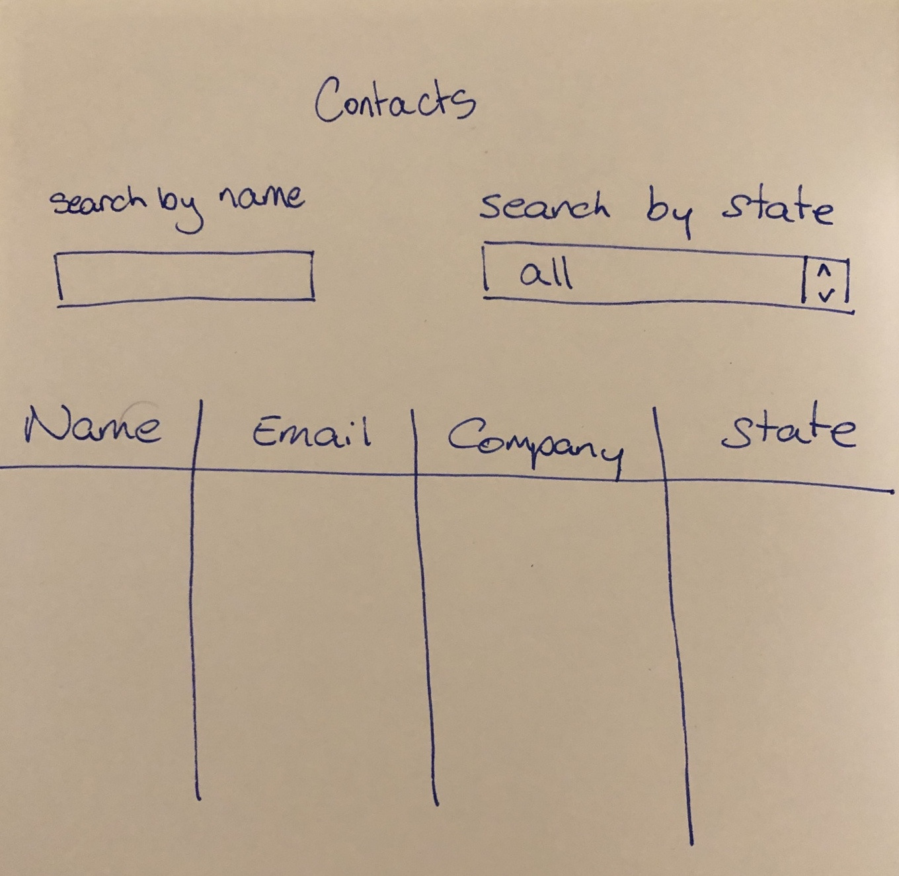
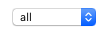
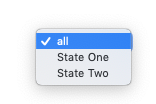

### This exercise is designed to...
- Test your knowledge of `React` and `javascript`
- Test some basic `css` and `html` concepts
- See how you write and organise your code

### If you have any questions at any time please contact us at alex@eventhub.com.au

### We expect you to spend no more than three hours on this exercise.

## Your Task

1. Clone this repository and create a new version in your own github account
2. In the repo directory run
    ```bash
    npm start
    ```
3. Navigate to http://localhost:3000/ in your browser
4. Edit the file according to the instructions below
5. Commit your changes
6. Email alex@eventhub.com.au with a url to your repo
7. We will contact you when we have received the email and accessed your repository
8. If your repository is private you will need to grant access to https://github.com/alexi21

## Instructions

In the `App.js` file you will find a function `getContacts`, this function mocks an API call and returns a Promise of an Array.

Your task is to create a simple table of contacts, with two filters.

#### The table and filters should look like this:

<p align="left">
  
</p>

### Filters

##### Name Filter
- name filter takes a string and matches against the full name (first and last name) of the contact
- leaving all contacts that have the string somewhere in either their first or last names, in the table

#### State Filter
- state filter should have a selectable list of all states in the contacts list
- when a state is selected should leave only those contacts from that state in the table
- the first and initial option in the selectable list should be `all` which does not filter the table

<div align="left">
  
</div>
<div align="left">
  
</div>

<br/>

### Important

- You should NOT use any additional npm packages.

- You SHOULD use ES6 syntax if you can.

- Layout and other styling should be done LAST, and only if you have time.

<br/>
<br/>
<br/>

##### This project was bootstrapped with [Create React App](https://github.com/facebook/create-react-app).
